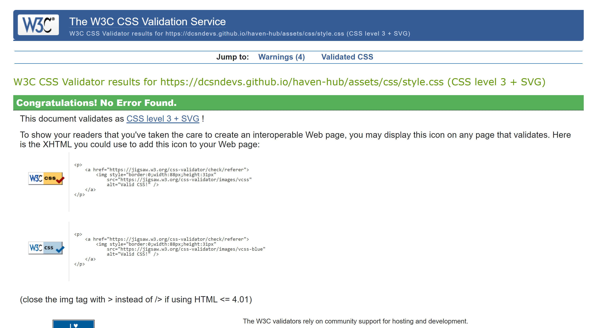

# 

## Welcome

**Haven Hub Care Services Limited** is an organisation that specialises in providing assisted living for people with special needs and is based in the United Kingdom. The website aims to present key contact information about the organisation and collect information from individuals who are interested in its services and offerings. You can find The link to the deployed site [Here](https://dcsndevs.github.io/haven-hub) 

## User Stories

### First Time Visitor Goals:
As a first-time visitor, my primary goal is to easily learn and gather about the organization. 
I want to be able easily get their contact details and find out their location.
It is important for me to understand the services they offer and how I can be involved with work.

### Returning Visitor Goals:
As a returning visitor, my goal is to obtain updated information about the organisation. I except to find the latest news, updates, and any changes that have occurred since my last visit. 

### Frequent Visitor Goals:
As a frequent visitor, I want to stay informed about any new job openings within the organisation. 
I am interested in knowing if they acquired new service centers in my area.
Additionally, I would like to stay updated on any ongoing charity projects that the organisation is involved in.

## Features

### Navigation Bar:

See also:
- [Nav bar for medium screens](documentation/images/nav-bar-small.png)
- [Navigation bar for smaller screens](documentation/images/nav-bar-smallest.png)

The Navigation bar is consistently present across all pages of the entire website. It helps the users of this website to easily move from one page to the other. It also displays a phone number that can be dialled with a single click, if the user is browsing through a device that has a calling application installed on it. The navigation bar also includes a Location link that can automatically list the address to the organisation on google maps, rather than typing the address manually. Finally, the Navigation bar includes the organisation logo written in large fonts, in other to help the user know with ease, that they are on the Haven Hub website and to also give a feel of the organisation's brand.

### Hero image with text:

See also:
- [Hero image with text on medium screens](documentation/images/hero-image-with-text-medium-screens.png)
- [Hero image with text on small screens](documentation/images/hero-image-with-text-small-screens.png)

The main image shows a staff administering medication to a client in a residential setting. A bold introductory message immediately lets the user know that this is a organisation that specialises in supported living and housing accommodations.

### About Us & Services Section:
- [About us section large screens](documentation/images/about-us-section.png)
- [About us section on medium screen](documentation/images/about-us-section-medium-screen.png)
- [About us section on small screen](documentation/images/about-us-section-small-screen.png)

This section is immediately under the hero image, and it is also a page. It can be viewed by either scrolling down further or by clicking the "About us" link on the navigation bar.
This section welcomes the user to the website with a brief introductory message of what the organisation does.
This section is divided into four sections and each of the remaining three sections explains the kind of services that is provided by the organisation.

### Get Involved Section:
- [Get involved section](documentation/images/get-involved-section.png)
- [Get involved section on medium screen](documentation/images/get-involved-section-medium.png)
- [Get involved section on small screen](documentation/images/get-involved-section-mobile.png)

Below the About Us & Services section is the Get Involved section (different from the get-involved page). This section can be visited by further scrolling. It consists of three responsive cards that visually depicts a call to action for the user. It immediately lets the user know that they can be involved in three ways - Volunteering, Donation, and Leasing their property to the organisation.

### Subscribe to Newsletter:
- [Subscribe to newsletter on smaller screens](<documentation/images/subscribe-to-newsletter-smaller screen.png>)
- [Subscribe to newsletter](documentation/images/subscribe-to-newsletter.png)
- [Subscribe to newsletters](documentation/images/subscribe-to-newsletter-s.png)
- [Subscribe to newsletter on large screen](documentation/images/subscribe-to-newsletter-on-large-screen.png)

This section is found towards the bottom of the page and it helps the user signup up to the organisation's newsletter. It was built with ease and seeks to secure the subscription by just accepting one input field and then collecting the user's email address.

### Footer:
- [Footer on small screen](documentation/images/footer-smaller-screen.png)
- [Footer on large screen](documentation/images/footer-large-screen.png)
- [Footer on medium screen](documentation/images/footer-small-screen.png)

Like the Navigation bar, the footer maintains the same design and content throughout all the pages of the website. It contains the organisation's social links which when clicked opens the social site on a new window and still keeps Haven hub's website open. This helps the user to still stay active in what they were doing on the organisation's website. 
The footer also contains the organisation's phone number and physical address/ The address when clicked also opens a google map for ease of direction. Likewise, the phone number when clicked, would attempt to dial the number if the user were using a mobile device  or a computer that has Call abilities.

### Get Involved Page:
- [Get involved page on mobile devices](documentation/images/get-involved-page-mobile.png)
- [Get involved page on full display on large screen](documentation/images/get-involved-page-medium-full.png)
- [Get involved volunteer](documentation/images/get-involved-volunteer.png)

By clicking the Get Involved link on the menu on the navigation bar, the user can visit this page. The page gives more explanation to the Get-involved section that we witnessed on the home page. It encourages he user to take action by signing up and participating by volunteering, donations and leasing properties to the organisation.

### Sign Up Page:
- [Sign up page](documentation/images/sign-up-page.png)

The [Signup page](https://dcsndevs.github.io/haven-hub/contact-us.html) contains a web form that collects the user's data based on the reason why they are contacting the organisation. The user has the options and choose to become a client, donate, volunteer, lease their property and subscribe to the organisation's newsletter.
At the moment, the form is not connected to any database but only make use of a 'Get' form action. There are future plans of connecting it using JavaScript, PHP and MYSQL in other to store what is submitted.

### Thank you Page:
- [Contact us feedback](documentation/images/thank-you-message.png)
- [Subscription successful](documentation/images/subscription-successful.png)

There are two thank you page with same layout but different messages. 
[The first](https://dcsndevs.github.io/haven-hub/contact-us.html), is a message that users who Signed up via the contact us page gets to see. It informs the user that their details have been received, and that they would be contacted shortly.
[The second](https://dcsndevs.github.io/haven-hub/newsletter-thankyou.html), refers to users who specifically used the Newsletter subscription form from the Homepage. It lets the user know that they have successfully subscribed to receive newsletter from the organisation.

There is a future plan to allow the user receive a pop-up after submitting through the contact page and then gives the user an option to return to the homepage. This would reduce the number of pages for the website as a whole, and is a faster and more user-friendly method rather than allowing another page load before confirming actions to the users.

### 404 Error Page:

The [404 Error](https://dcsndevs.github.io/haven-hub/404.html) is a safety net for broken links. The name of the file 404.html was created according to [Github's standard](https://docs.github.com/en/pages/getting-started-with-github-pages/creating-a-custom-404-page-for-your-github-pages-site) for showing visitors a message in a situation where the intended link becomes unavailable. If a link is unavailable, the host, in this case Github, redirects the user to 404.html by default. This prevents the user from having a total bad experience an ensures that the user still remains on the website.

## Testing

Various tools have been used in testing the overall performance of the website from beginning to end. I have listed them in no particular other below:

Responsive Design Tester by Media Genesis was used to view the website on different media screens. Click any title below to view the site's appearance on the screen.

### Links & Feature Test
- [Link to first video before Homepage redesign YouTube Video of live testing](https://youtu.be/CFa9-n3SuaA)
- [Current YouTube Video of live testing](https://youtu.be/e_SBWsyzmAA)
 

- [Fixed Email Input on Contact form](documentation/images/gifs/contact-form-fix.gif)
- [Phone Link Test](documentation/images/gifs/phone-call-link-test.gif)

 ### Responsive Screen Displays
- [Responsiveness Test across multiple device sizes](https://youtu.be/3OcypStVrsA)
 

    #### Old Gifs Images of Homepage responsiveness:
    [Mobile Screens 375 x 667](documentation/images/gifs/haven-hub-375-responsiveness.gif)

    [Tablet Screen 768 x 1024](documentation/images/gifs/haven-hub-768-responsiveness.gif)

    [Laptop Screen 1024 x 800](documentation/images/gifs/haven-hub-1024-responsiveness.gif)

    [Desktop Screen 1920 x 1200](documentation/images/gifs/haven-hub-1920-responsiveness.gif)

### Manual Testing 
| Feature | Action | Expected Result | Tested | Passed | Comments |
| --- | --- | --- | --- | --- | --- |
|  |  | **Home Page** |  |  |  |
| *Homepage Navigation* |  |  |  |  |  |
| Logo | Click on Haven hub logo | User is redirected to index.html | yes | Yes | - |
| Home | Click on Link | User is redirected to index.html  | yes | Yes | - |
| Get-Involved | Click on Link | User is redirected to get-involved.html | yes | Yes | - |
| Contact-us | Click on Link | User is redirected to contact-us.html | yes | Yes | - |
| Location | Click on Link | User is redirected to Google maps | yes | Yes | It opens with a pre-filled address |
| Phone | Click on Link | User is redirected to device calling feature | yes | Yes | - |
| *Homepage Buttons* |  |  |  |  |  
| Enquiries | Click on Button | User is redirected to contact-us.html | yes | Yes | - |
| Volunteer | Click on Button | User is redirected to contact-us.html | yes | Yes | - |
| Donate | Click on Button | User is redirected to contact-us.html | yes | Yes | - |
| Lease | Click on Button | User is redirected to contact-us.html | yes | Yes | - |
| Subscribe | Click on Button | User is redirected to newsletter-thankyou.html | yes | Yes | Under the condition that a validated email is entered in the input section |
| *Homepage Footer* |  |  |  |  |  
| Facebook | Click on icon | User is redirected to external Facebook website | yes | Yes | - |
| Twitter | Click on icon | User is redirected to external Twitter website | yes | Yes | - |
| Instagram | Click on icon | User is redirected to external Instagram website | yes | Yes | - |
| Phone | Click on Link | User is redirected to device calling feature | yes | Yes | - |
| Location | Click on Link | User is redirected to Google maps | yes | Yes | It opens with a pre-filled address |
  |  |  | **Get-Involved Page** |  |  |
| *Get-involved Navigation* |  |  |  |  |  |
| Logo | Click on Haven hub logo | User is redirected to index.html | yes | Yes | - |
| Home | Click on Link | User is redirected to index.html  | yes | Yes | - |
| Get-Involved | Click on Link | User is redirected to get-involved.html | yes | Yes | - |
| Contact-us | Click on Link | User is redirected to contact-us.html | yes | Yes | - |
| Location | Click on Link | User is redirected to Google maps | yes | Yes | It opens with a pre-filled address |
| Phone | Click on Link | User is redirected to device calling feature | yes | Yes | - |
| *Get-involved page Buttons* |  |  |  |  |  
| Volunteer | Click on Button | User is redirected to contact-us.html | yes | Yes | - |
| Donate | Click on Button | User is redirected to contact-us.html | yes | Yes | - |
| Start! | Click on Button | User is redirected to contact-us.html | yes | Yes | - |
| *Get-involved Page Footer* |  |  |  |  |  
| Facebook | Click on icon | User is redirected to external Facebook website | yes | Yes | - |
| Twitter | Click on icon | User is redirected to external Twitter website | yes | Yes | - |
| Instagram | Click on icon | User is redirected to external Instagram website | yes | Yes | - |
| Phone | Click on Link | User is redirected to device calling feature | yes | Yes | - |
| Location | Click on Link | User is redirected to Google maps | yes | Yes | It opens with a pre-filled address |
|  |  | **Contact-us Page** |  |  |
| *Contact-us Navigation* |  |  |  |  |  |
| Logo | Click on Haven hub logo | User is redirected to index.html | yes | Yes | - |
| Home | Click on Link | User is redirected to index.html  | yes | Yes | - |
| Get-Involved | Click on Link | User is redirected to get-involved.html | yes | Yes | - |
| Contact-us | Click on Link | User is redirected to contact-us.html | yes | Yes | - |
| Location | Click on Link | User is redirected to Google maps | yes | Yes | It opens with a pre-filled address |
| Phone | Click on Link | User is redirected to device calling feature | yes | Yes | - |
| *Contact-us page Buttons* |  |  |  |  |  
| Submit | Click on Button | User is redirected to thankyou.html | yes | Yes | Under the condition that a valid email and required fields are entered|
| Reset | Click on Button | The form is reset | yes | Yes | - |
| *Contact-us Page Footer* |  |  |  |  |  
| Facebook | Click on icon | User is redirected to external Facebook website | yes | Yes | - |
| Twitter | Click on icon | User is redirected to external Twitter website | yes | Yes | - |
| Instagram | Click on icon | User is redirected to external Instagram website | yes | Yes | - |
| Phone | Click on Link | User is redirected to device calling feature | yes | Yes | - |
| Location | Click on Link | User is redirected to Google maps | yes | Yes | It opens with a pre-filled address |

### Browser Testing
The final project was tested on four different browsers, namely:
-Microsoft Internet explorer
-Google Chrome
-Brave
-Mozilla Firefox
The output was similar on all these browsers except on Mozila firefox, where the fonts appeared darker and were therefore better viewed in terms of clarity and contrast. In addition, the buttons on the "get-involved" section (not page) of the index page were observed to overlap the text above them. I was able to correct this error by adding more padding on top of the buttons.

### Google PageSpeed Insights:
Google page speed insights was used to test the speed of the website and various issues were highlighted which was followed by subsequent adjustments.
A notable issue raised was that of the body font being high in contrast. The font (Diphlliea) was then changed to Roboto. High contrast fonts are difficult to read by some users and also on some devices.

- [Index Page Mobile (Current)](https://pagespeed.web.dev/analysis/https-dcsndevs-github-io-haven-hub/r2s9s49ea7?form_factor=mobile)

- [Index Page Desktop (Current)](https://pagespeed.web.dev/analysis/https-dcsndevs-github-io-haven-hub/r2s9s49ea7?form_factor=desktop)

See also:
- [Index Page Mobile(Old)](https://pagespeed.web.dev/analysis/https-dcsndevs-github-io-haven-hub/r2s9s49ea7?form_factor=mobile)

- [Index Page Desktop (Old)](https://pagespeed.web.dev/analysis/https-dcsndevs-github-io-haven-hub/r2s9s49ea7?form_factor=desktop)

- [Get Involved Page Mobile](https://pagespeed.web.dev/analysis/https-dcsndevs-github-io-haven-hub-get-involved-html/i6xp9ym1x3?form_factor=mobile)

- [Get Involved Page Desktop](https://pagespeed.web.dev/analysis/https-dcsndevs-github-io-haven-hub-get-involved-html/i6xp9ym1x3?form_factor=desktop)

- [Contact Us Page Mobile](https://pagespeed.web.dev/analysis/https-dcsndevs-github-io-haven-hub-contact-us-html/i3mv69wajy?form_factor=mobile)

- [Contact Us Page Desktop](https://pagespeed.web.dev/analysis/https-dcsndevs-github-io-haven-hub-contact-us-html/i3mv69wajy?form_factor=desktop)

- [Thank You Page Mobile](https://pagespeed.web.dev/analysis/https-dcsndevs-github-io-haven-hub-thankyou-html/qpcap08jog?form_factor=mobile)

- [Thank You Page Desktop](https://pagespeed.web.dev/analysis/https-dcsndevs-github-io-haven-hub-thankyou-html/qpcap08jog?form_factor=desktop)

- [Newsletter Thank You Page Mobile](https://pagespeed.web.dev/analysis/https-dcsndevs-github-io-haven-hub-newsletter-thankyou-html/8xcycq1qls?form_factor=mobile)

- [Newsletter Thank You Page Desktop](https://pagespeed.web.dev/analysis/https-dcsndevs-github-io-haven-hub-newsletter-thankyou-html/8xcycq1qls?form_factor=desktop)

- [404 Error Mobile](https://pagespeed.web.dev/analysis/https-dcsndevs-github-io-haven-hub-404-html/tvxphjh6gb?form_factor=mobile)

- [404 Error Desktop](https://pagespeed.web.dev/analysis/https-dcsndevs-github-io-haven-hub-404-html/tvxphjh6gb?form_factor=desktop)

### HTML Validator:
1. The W3 validator (validator.w3.org) highlighted errors on the website's links. Arial-label instead of aria-label had been used, and 15 errors were found and corrected.
2. An element had been left exposed on the about section and this was detected and corrected afterwards. Click the links below to visit the HTML validation page.

- [Index page (Current)](https://validator.w3.org/nu/?doc=https%3A%2F%2Fdcsndevs.github.io%2Fhaven-hub%2F)

See also:

- [Index page (Old)](https://validator.w3.org/nu/?doc=https%3A%2F%2Fdcsndevs.github.io%2Fhaven-hub%2F)

- [Get Involved Page](https://validator.w3.org/nu/?doc=https%3A%2F%2Fdcsndevs.github.io%2Fhaven-hub%2Fget-involved.html)

- [Contact Us Page](https://validator.w3.org/nu/?doc=https%3A%2F%2Fdcsndevs.github.io%2Fhaven-hub%2Fcontact-us.html)

- [404 Error Page](https://validator.w3.org/nu/?doc=https%3A%2F%2Fdcsndevs.github.io%2Fhaven-hub%2F404.html)

- [Thank You Page](https://validator.w3.org/nu/?doc=https%3A%2F%2Fdcsndevs.github.io%2Fhaven-hub%2Fthankyou.html)

- [Newsletter Page](https://validator.w3.org/nu/?doc=https%3A%2F%2Fdcsndevs.github.io%2Fhaven-hub%2Fnewsletter-thankyou.html)
            

### CSS Validator:
1. The W3 validator highlighted 5 errors regarding the use of a wrongly written code for background-color, align-items and position. These codes were then rewritten correctly.
2. The validator highlighted 5 warnings regarding using same background color and border colors for the buttons on the pages.
3. The validator highlighted the usage of a wrong value in some codes and this was corrected afterwards.
Click the link below to visit the CSS validation page.

 - [Current CSS Test](documentation/images/css-validator-success.png)
  

  See also:
 
 - [Current CSS Test - 4 Warnings](documentation/images/css-validator-warning.png)

 - [First CSS Test showing Error (Old)](documentation/images/jigsaw.w3.org_css-validator_validator_error.png)
 
 - [Second CSS Test after error was fixed(Old)](documentation/images/jigsaw.w3.org_css-validator_validator_error-free.png)
  

### Color Contrast:

[Deque's University Color Contrast Analyzer](https://dequeuniversity.com/rules/axe/4.7/color-contrast) was used to determine what colors go together This ensures that users of all kind can clearly view texts and image/button borders. Some users might be color blind or are people with low vision experience. This tool ensures that the best colours are used in other to guarantee their convenience. A brief understanding of this would be an instance where a white text is put on a yellow background. Both colors are too bright and would be difficult to read for most users.

## Blasmiq:
Blasmiq was used to draw mock-ups for the first set of website design to guide in the development of this project.
- [Blasmiq homepage design 1](documentation/images/blasmiq-wireframe-1.png)
- [Blasmiq homepage design 2](documentation/images/blasmiq-wireframe-2.png)

            
## Unfixed Bugs:

I encountered issues with the footer the signup and thank you pages. The footers were floating because the page didn't have enough content and then scrolling was an issue in mobile screens - This tutorial by [Sir Chogyal](https://www.youtube.com/watch?v=J-r75L3Tflg) helped me through it.

## Technologies used:
- HTML was used as the main language for the website.
- CSS was used to add styles and layout to the website.
- Blasmiq was used to create wireframes to pre-deign and guide the site's layout and designs
- VScode was used to write and edit the codes and host the site my local computer
- Git was used for the version control of the website
- GitHub was used to host the deployed website
- Tiny Png was used to compress the images on the site
- Image resizer was used to resize images on the site

## Deployment

The site was deployed using Github and was pushed through via Vscode.
The repository was created on Github and then cloned on Vscode. After creating the site on Vscode, it was pushed onto Github.
The site was then deployed via Github pages by:

    - Selecting the settings tab inside the repo on Github
    - Selecting Deploy from a branch under 'Build and deployment'
    - Selecting Main under branch
    - Click save
After these steps, the site would have been deployed and becomes live at <https://dcsndevs.github.io/haven-hub>

### Local Deployment:
To clone this project, you can do so using VsCode or any code editor that has an integrated development Environment (IDE), using this command: 

     git clone https://github.com/dcsndevs/haven-hub.git

## Credits

### Content:
- While creating the elements on the index page, I struggled with aligning the texts and contents to an absolute center. I was then introduced to the Flex box tutorial by [Kelvin Powell](https://www.youtube.com/user/KepowOb) on [YouTube](https://www.youtube.com/watch?v=hwbqquXww-U&list=PL4-IK0AVhVjMSb9c06AjRlTpvxL3otpUd&ab_channel=KevinPowell). Another [Youtube Tutorial](https://www.youtube.com/watch?v=fYq5PXgSsbE) from [Patreon](https://patreon.com/) also proved useful.
- In preparation for this website, I used Balsamiq to create wireframes to guide me through the project. Even though the final website didn't look exactly like the wireframe, it provide a guide on the journey and was important to helping me achieve the final design.

### Fonts & Icons:

The fonts used were imported from [Google Fonts]("https://fonts.google.com/) and the Icons were from [Font Awesome](https://fontawesome.com/) 
Regular 400 Font Abel and Roboto were mainly used. Garamond was also applied on the home page for mobile devices because the initial font was found to cause layout displacement issues as suggested when the page was tested on [Page Speed](https://pagespeed.web.dev/)

### Colors:

Black (#000000), Green (#009B4D), Dark Green (#006400), Ivory (#FAF5E9), and Tangerine Yellow (#FFCC00) were the main colors used for this site. [Hostinger's](https://www.hostinger.com/tutorials/website-color-schemes) color scheme tutorial inspired the use of Dark Green, Ivory, and Yellow. The color Pallete according to it, suggests they are "easy on the eyes, making the website seem relaxing and organic"

### Animations:

The animation used for the intro message is "text-focus-in" animation gotten from [Animista](https://animista.net/play/text/focus-in/text-focus-in)

### Images:

All the images used in the creation of this website were sourced on Pexels, Unsplash and W3 websites. Below is a list of the images used and their links: 
1. Photo by [Kampus Production](https://www.pexels.com/photo/woman-in-white-shirt-sitting-beside-woman-in-black-long-sleeve-shirt-7551652/)
2. Photo from  [W3 Web Themes](https://www.w3schools.com/w3images/house2.jpg)
3. Photo by [Doan Anh](https://unsplash.com/photos/8irA6aCfgDs)
4. Photo by [Andrea Piacquadio](https://www.pexels.com/photo/joyful-adult-daughter-greeting-happy-surprised-senior-mother-in-garden-3768131/)
5. Photo by [Pixabay](https://www.pexels.com/photo/2-person-holding-hands-45842/)
6. Photo by [Mikhail Nilov](https://www.pexels.com/photo/woman-helping-a-man-sitting-on-a-chair-6981012/) 
7. Photo by [Liza Summer](https://www.pexels.com/photo/cheerful-ethnic-woman-with-donate-box-6348123/)
8. Photo by [Lisa Fotios](https://www.pexels.com/photo/houses-in-town-3825883/)

 - [Image Resizer](https://imageresizer.com/) and [TinyPng](https://tinypng.com/) were used to respectively resize and compress all the images on this site.
 - [Ezgif.com](https://ezgif.com/) was used to covert videos to the animated gif images that was used to show live tests.
 - [Screenshot & Screen Recorder](https://ezgif.com/) was used to record live tests and used to create videos therefore.
 - [Am I Responsive](https://ami.responsivedesign.is/) website was used to simultaneously display how the site looks on different screen sizes.
 - [Canva](https://canva.com/) software was used to edit and design images.

### Acknowledgements:

In the build-up of the website, I drew a lot of inspiration from my mentor [Juliia Konn](https://github.com/IuliiaKonovalova/) who guided me throughout this work. She explained difficult terminologies and helped break down complex structures. [Juliia](https://github.com/IuliiaKonovalova/) pushed me and was unstatisfied with average. She wanted an excellent project and encourage me to get this far.

I would like to express my gratitude to my loving wife for her support in the course of this work. She hass been taking up most of my shifts for babysitting our son to allow me give more time to this work.
